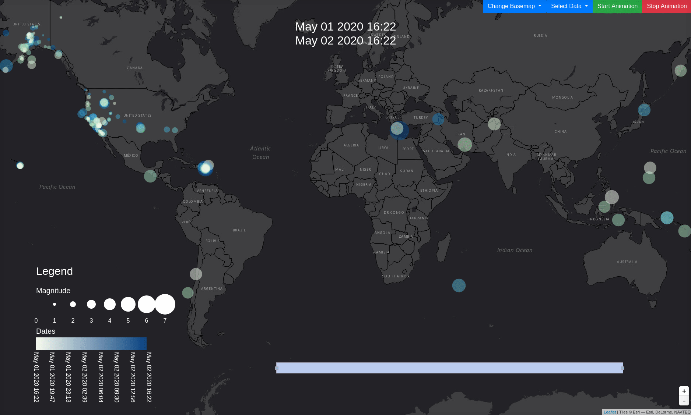

# Dynamic Mapping and Spatial Data Visualization Course

## Syllabus
https://shnaton.huji.ac.il/index.php/NewSyl/40891/2/2020/

**Dynamic mapping and spatial data visualization - 40891**
Last update 09-11-2019

*HU Credits:* 2

*Degree/Cycle:* 2nd degree (Master)

*Responsible Department:* Geography

*Semester: 2nd* Semester

*Teaching Languages:* Hebrew

*Campus:* Mt. Scopus

*Course/Module Coordinator:* Dr. Michal Lichter

*Coordinator Email:* Michal.Lichter@mail.huji.ac.il

*Coordinator Office Hours:* Wed 5:30 PM

*Teaching Staff:* Dr. Michal Lichter

*Course/Module description:*
This course will explore different kinds of spatial data and the appropriate ways to visualize them. Real world data will be used to illustrate the issues, problems and solutions encountered when visualizing spatial data. Different mapping platforms will be leveraged to create dynamic interactive maps

course github repository: https://github.com/mlichter2/interactive_visualizations_huji

*Course/Module aims:*
Acquiring knowledge and skills in dynamic mapping and spatial data visualization

*Learning outcomes - On successful completion of this module, students should be able to:*
 * Choose the right visualization techniques for different type of spatial data
 * Generate dynamic maps for EDA (Exploratory Data analysis) purposes
 * Generate Customized Interactive Dynamic maps using JavaScript libraries and mapping APIs
 * Apply the knowledge and skill acquired in 1-3 to produce interactive space and time-dynamic 3d maps

*Attendance requirements(%):*
80

*Teaching arrangement and method of instruction:*

*Course/Module Content:*

presentations: https://drive.google.com/drive/folders/1plYb67xNpOxXX1s40XVFds00Q1ABjezR?usp=sharing

1. Introduction and general concepts
Understanding spatial data, symbology and visualization techniques
Acquiring skills for spatial data visualization assessment
2. Brief introduction to HTML, CSS and JavaScript
3. Dynamic and interactive maps using leaflet and D3.js
Introduction to D3.js and Javascript mapping libraries
Color schemes: html colors and color scales in d3
Adding the time dimension: dates in JavaScript
Adding interactions and dynamic data filtering: buttons, sliders, menus and more
Adding an interactive legend
Using additional JavaScript libraries
Base maps
4. 3D and time-dynamic mapping with Cesium.js - WebGL Virtual Globe
Introduction to Cesium.js
3D mapping
Adding temporal data and time-dynamic interactions +introduction to CZML
Terrain and shadows

*Required Reading:*
-

*Additional Reading Material:*
-

*Course/Module evaluation:*
 * End of year written/oral examination 0 %
 * Presentation 0 %
 * Participation in Tutorials 0 %
 * Project work 0 %
 * Assignments 100 %
 * Reports 0 %
 * Research project 0 %
 * Quizzes 0 %
 * Other 0 %

*Additional information:*

course github repository: https://github.com/mlichter2/interactive_visualizations_huji